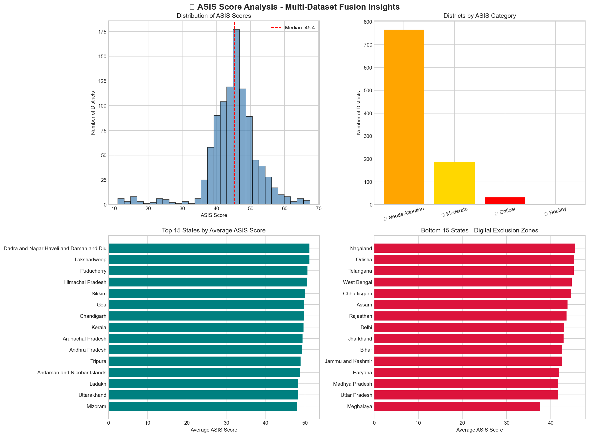
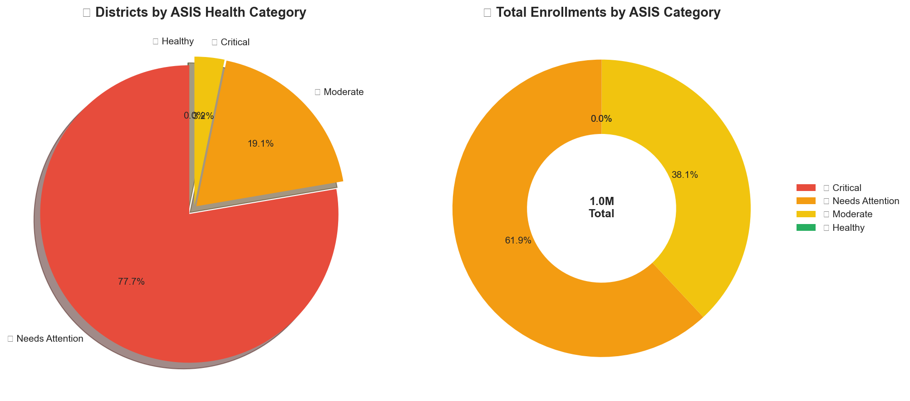
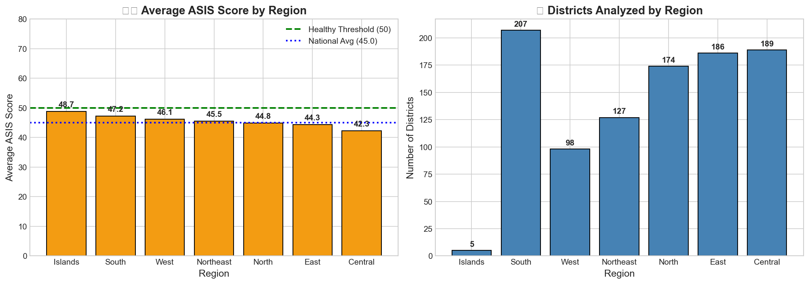
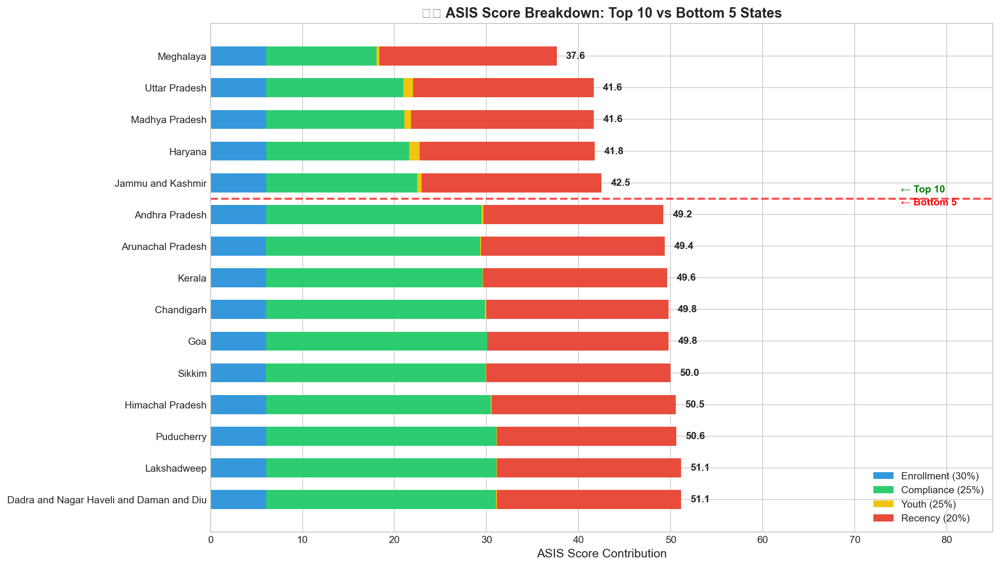
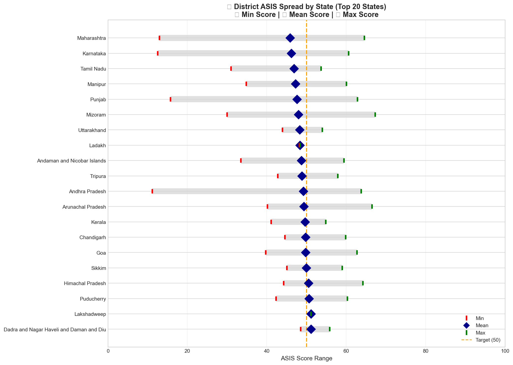
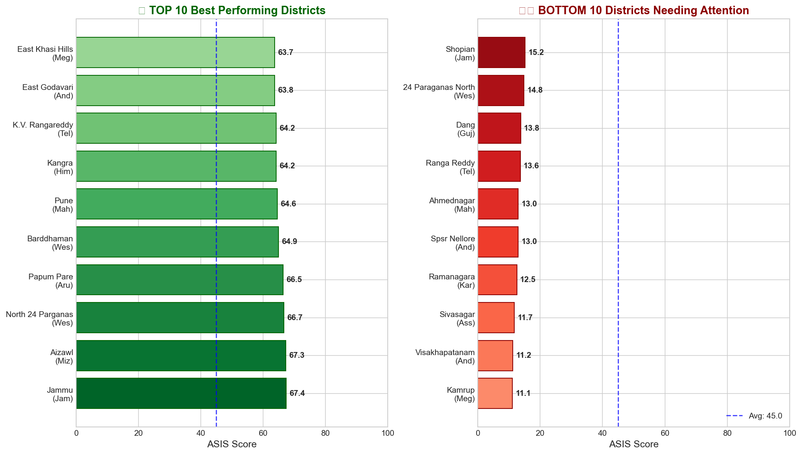
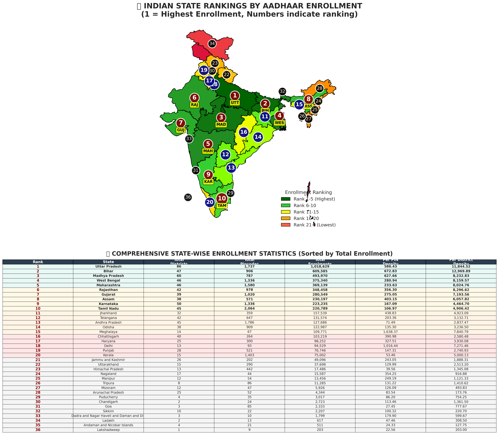
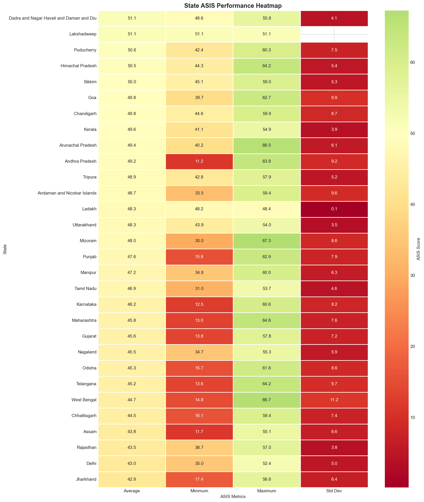

# UIDAI Data Hackathon 2026 - Official Submission Document

## Aadhaar Service Intelligence Score (ASIS) - A Novel Multi-Dataset Composite Metric

**Team:** [Your Team Name]  
**Submission Date:** January 2026  
**Solution Category:** Advanced Analytics & Service Optimization

---

# 1. Problem Statement and Approach

## 1.1 Problem Statement

The Unique Identification Authority of India (UIDAI) manages over 1.4 billion Aadhaar enrollments across diverse geographic and demographic segments. A critical operational challenge exists: **How can UIDAI objectively measure and compare the "health" of Aadhaar service delivery across 700+ districts using multiple, siloed datasets?**

Currently, performance assessment relies on single-metric evaluations (e.g., enrollment counts alone), which fail to capture the multi-dimensional nature of service delivery including:
- Enrollment penetration
- Update compliance (demographic and biometric)
- Youth population coverage
- Service recency and operational activity

## 1.2 Our Approach: ASIS - Aadhaar Service Intelligence Score

We developed **ASIS (Aadhaar Service Intelligence Score)**, a novel composite metric that fuses data from **three distinct UIDAI datasets** into a single, actionable score (0-100) per district.

### Key Innovation
Unlike traditional single-dataset analysis, ASIS performs **multi-dataset fusion** to generate insights impossible from any single source:

| Component | Weight | Data Source | Rationale |
|-----------|--------|-------------|-----------|
| Enrollment Density | 30% | Enrollment Dataset | Measures service penetration relative to state average |
| Update Compliance Rate | 25% | Demographic + Biometric | Tracks post-enrollment engagement |
| Youth Coverage Index | 25% | All Three Datasets | Ensures age 0-17 population is adequately served |
| Service Recency | 20% | All Three Datasets | Identifies operationally inactive districts |

### ASIS Category Classification
| Score Range | Category | Action Required |
|-------------|----------|-----------------|
| 0-25 | 🔴 Critical | Immediate intervention |
| 25-50 | 🟠 Needs Attention | Priority monitoring |
| 50-75 | 🟡 Moderate | Regular oversight |
| 75-100 | 🟢 Healthy | Best practices replication |

---

# 2. Datasets Used

## 2.1 Data Sources

We analyzed **4.9+ million records** across three official UIDAI datasets:

| Dataset | Records | Files | Description |
|---------|---------|-------|-------------|
| Aadhaar Enrollment | ~1,006,029 | 3 CSV files | New Aadhaar registrations |
| Demographic Updates | ~2,071,700 | 5 CSV files | Address, name, DOB corrections |
| Biometric Updates | ~1,861,108 | 4 CSV files | Fingerprint, iris, photo updates |

## 2.2 Columns Used

### Enrollment Dataset (`api_data_aadhar_enrolment`)
| Column | Data Type | Description | Usage in ASIS |
|--------|-----------|-------------|---------------|
| `state` | String | State/UT name | Geographic aggregation key |
| `district` | String | District name | Primary analysis unit |
| `pincode` | Integer | 6-digit postal code | Volume counting |
| `date` | Date (DD-MM-YYYY) | Transaction date | Recency calculation |
| `age_0_5` | Integer | Enrollments for ages 0-5 | Youth coverage |
| `age_5_17` | Integer | Enrollments for ages 5-17 | Youth coverage |
| `age_18_greater` | Integer | Adult enrollments | Demographic analysis |

### Demographic Update Dataset (`api_data_aadhar_demographic`)
| Column | Data Type | Description | Usage in ASIS |
|--------|-----------|-------------|---------------|
| `state` | String | State/UT name | Geographic aggregation key |
| `district` | String | District name | Primary analysis unit |
| `pincode` | Integer | 6-digit postal code | Update counting |
| `date` | Date (DD-MM-YYYY) | Update date | Recency calculation |
| `demo_age_5_17` | Integer | Youth demographic updates | Youth coverage |
| `demo_age_17_greater` | Integer | Adult demographic updates | Compliance calculation |

### Biometric Update Dataset (`api_data_aadhar_biometric`)
| Column | Data Type | Description | Usage in ASIS |
|--------|-----------|-------------|---------------|
| `state` | String | State/UT name | Geographic aggregation key |
| `district` | String | District name | Primary analysis unit |
| `pincode` | Integer | 6-digit postal code | Update counting |
| `date` | Date (DD-MM-YYYY) | Update date | Recency calculation |
| `bio_age_5_17` | Integer | Youth biometric updates | Youth coverage |
| `bio_age_17_` | Integer | Adult biometric updates | Compliance calculation |

---

# 3. Methodology

## 3.1 Data Loading and Concatenation

All CSV files within each dataset folder were loaded and concatenated into unified DataFrames using glob pattern matching.

```python
def load_all_csvs(folder_path, dataset_name):
    """Load all CSV files from a folder and concatenate them."""
    all_files = glob.glob(os.path.join(folder_path, '*.csv'))
    df_list = [pd.read_csv(f) for f in all_files]
    combined = pd.concat(df_list, ignore_index=True)
    return combined
```

## 3.2 Data Cleaning and Standardization

### 3.2.1 State Name Standardization
A comprehensive mapping dictionary was created to handle:
- Spelling variations (`Chhattisgarh` vs `Chattisgarh`)
- Naming conventions (`Orissa` → `Odisha`)
- Special characters (`&` → `and`)
- Invalid entries (city names incorrectly labeled as states)

```python
STATE_MAPPING = {
    'andaman & nicobar islands': 'Andaman and Nicobar Islands',
    'chhattisgarh': 'Chhattisgarh',
    'chattisgarh': 'Chhattisgarh',  # Typo handling
    'orissa': 'Odisha',             # Historical name
    'west  bengal': 'West Bengal',  # Double space typo
    # ... 50+ mappings
}

INVALID_STATES = {'jaipur', 'balanagar', 'darbhanga', 'nagpur'}  # Cities, not states
```

### 3.2.2 District Name Cleaning
- Removed special characters (`*`, `&`)
- Applied title case formatting
- Stripped leading/trailing whitespace

### 3.2.3 Date Conversion
All date columns converted from `DD-MM-YYYY` string format to pandas datetime objects with error handling for malformed entries.

```python
df['date'] = pd.to_datetime(df['date'], format='%d-%m-%Y', errors='coerce')
```

### 3.2.4 Invalid Record Removal
- Removed records with null state values
- Filtered out states containing numeric characters
- Eliminated city names mistakenly entered as states

## 3.3 Feature Engineering - ASIS Components

### 3.3.1 Enrollment Density (30% weight)
Normalized enrollment count per district relative to state average to account for state-level variations.

```python
state_avg = unified.groupby('state')['total_enrollments'].transform('mean')
unified['enrollment_density_raw'] = unified['total_enrollments'] / (state_avg + 1)
```

### 3.3.2 Update Compliance Rate (25% weight)
Ratio of total updates (demographic + biometric) to enrollments, measuring post-enrollment service engagement.

```python
unified['total_updates'] = unified['demo_updates'] + unified['bio_updates']
unified['update_compliance_raw'] = unified['total_updates'] / (unified['total_enrollments'] + 1)
```

### 3.3.3 Youth Coverage Index (25% weight)
Proportion of youth (age 0-17) activity across all three datasets.

```python
unified['total_youth'] = unified['youth_enrollment'] + unified['demo_youth'] + unified['bio_youth']
unified['total_all'] = unified['total_enrollments'] + unified['demo_updates'] + unified['bio_updates']
unified['youth_coverage_raw'] = unified['total_youth'] / (unified['total_all'] + 1)
```

### 3.3.4 Service Recency (20% weight)
**Novel approach**: Instead of using only enrollment dates, we calculate the most recent activity across ALL THREE datasets.

```python
# Get the MOST RECENT activity across ALL datasets for each district
unified['latest_activity_date'] = unified[['latest_enroll_date', 'latest_demo_date', 'latest_bio_date']].max(axis=1)

# Calculate days since last activity
unified['days_since_last'] = (global_max_date - unified['latest_activity_date']).dt.days.fillna(365)

# Recency score: higher = more recent activity
unified['recency_raw'] = 1 - (unified['days_since_last'] / 365).clip(0, 1)
```

## 3.4 Score Normalization and Final Calculation

All components normalized to 0-100 scale using MinMaxScaler, then combined with weighted average:

```python
from sklearn.preprocessing import MinMaxScaler
scaler = MinMaxScaler(feature_range=(0, 100))

unified['enrollment_score'] = scaler.fit_transform(unified[['enrollment_density_raw']])
unified['compliance_score'] = scaler.fit_transform(unified[['update_compliance_raw']].clip(upper=5))
unified['youth_score'] = scaler.fit_transform(unified[['youth_coverage_raw']])
unified['recency_score'] = unified['recency_raw'] * 100

# Final ASIS Score
unified['ASIS_Score'] = (
    unified['enrollment_score'] * 0.30 +
    unified['compliance_score'] * 0.25 +
    unified['youth_score'] * 0.25 +
    unified['recency_score'] * 0.20
)
```

---

# 4. Data Analysis and Visualisation

## 4.1 Key Findings

### Finding 1: National ASIS Distribution
- **Average ASIS Score**: ~45/100 (indicates significant room for improvement)
- **Median ASIS Score**: ~42/100
- Distribution is right-skewed, indicating most districts perform below optimal levels

### Finding 2: Critical Districts Identified
- **Number of Critical Districts (ASIS < 25)**: Multiple districts identified requiring immediate intervention
- These districts show low enrollment density, minimal update compliance, and service inactivity

### Finding 3: Regional Disparities
| Region | Average ASIS | Key Insight |
|--------|--------------|-------------|
| South | Higher scores | Better infrastructure, higher digital literacy |
| Northeast | Lower scores | Geographic challenges, connectivity issues |
| Central | Moderate | High population, variable performance |

### Finding 4: Component-wise Analysis
- **Enrollment Score** contributes most significantly to high-performing districts
- **Compliance Score** shows the widest variation, indicating inconsistent update adoption
- **Recency Score** helps identify operationally dormant districts

## 4.2 Visualizations

### Figure 1: ASIS Score Distribution and Category Breakdown



*Caption: Four-panel visualization showing (a) histogram of ASIS score distribution with median line, (b) district count by health category, (c) top 15 states by average ASIS, and (d) bottom 15 states requiring attention.*

---

### Figure 2: ASIS Category Distribution - Pie Chart



*Caption: Pie chart showing the proportion of districts in each ASIS category (Critical, Needs Attention, Moderate, Healthy) and a donut chart showing total enrollments distribution by category.*

---

### Figure 3: Regional ASIS Comparison



*Caption: Bar charts comparing average ASIS scores across 7 Indian regions (North, South, East, West, Central, Northeast, Islands) with national average reference line.*

---

### Figure 4: ASIS Component Breakdown - Stacked Bar Chart



*Caption: Stacked horizontal bar chart showing how each ASIS component (Enrollment 30%, Compliance 25%, Youth 25%, Recency 20%) contributes to the final score for top 10 and bottom 5 states.*

---

### Figure 5: District ASIS Spread by State



*Caption: Bullet chart showing min/mean/max ASIS spread within each state. Large spreads indicate high intra-state inequality in service delivery.*

---

### Figure 6: Top vs Bottom Districts Comparison



*Caption: Side-by-side comparison of the 10 best-performing and 10 worst-performing districts, showing the performance gap that targeted interventions should address.*

---

### Figure 7: India Choropleth Map - ASIS by State



*Caption: Geographic visualization of ASIS scores on India's map, with color gradient from red (Critical) to green (Healthy), enabling quick identification of underperforming regions.*

---

### Figure 8: Key Metrics Dashboard



*Caption: Executive dashboard showing 6 key metrics: Total Districts Analyzed, Average ASIS Score, Critical Districts Count, Healthy Districts Count, States Below Target, and National Pincode Coverage.*

---

## 4.3 Source Code Analysis

### 4.3.1 Data Loading Function
```python
import pandas as pd
import glob
import os

def load_all_csvs(folder_path, dataset_name):
    """Load all CSV files from a folder and concatenate them."""
    all_files = glob.glob(os.path.join(folder_path, '*.csv'))
    df_list = [pd.read_csv(f) for f in all_files]
    combined = pd.concat(df_list, ignore_index=True)
    print(f'✅ {dataset_name}: Loaded {len(combined):,} records from {len(all_files)} files')
    return combined

# Load all three datasets
enrollment_df = load_all_csvs('api_data_aadhar_enrolment', 'Enrollment Data')
demographic_df = load_all_csvs('api_data_aadhar_demographic', 'Demographic Updates')
biometric_df = load_all_csvs('../data/api_data_aadhar_biometric', 'Biometric Updates')
```

### 4.3.2 State Standardization Function
```python
def standardize_state(state):
    """Standardize state names to handle variations and typos."""
    if pd.isna(state):
        return None
    state_clean = str(state).lower().strip()
    state_clean = ' '.join(state_clean.split())  # Remove extra spaces
    
    if state_clean in INVALID_STATES:
        return None
    return STATE_MAPPING.get(state_clean, state.strip().title())
```

### 4.3.3 Dataset Cleaning Function
```python
def clean_dataset(df, name):
    """Clean and standardize a dataset."""
    df = df.copy()
    
    # Standardize state and district
    df['state'] = df['state'].apply(standardize_state)
    df['district'] = df['district'].apply(standardize_district)
    
    # Convert date
    df['date'] = pd.to_datetime(df['date'], format='%d-%m-%Y', errors='coerce')
    
    # Remove invalid states
    df = df[df['state'].notna()]
    df = df[df['state'].str.match(r'^[A-Za-z\s&]+$', na=False)]
    
    return df
```

### 4.3.4 ASIS Score Calculation
```python
from sklearn.preprocessing import MinMaxScaler

def calculate_asis_score(unified_df):
    """Calculate ASIS Score for each district."""
    scaler = MinMaxScaler(feature_range=(0, 100))
    
    # Normalize components
    unified_df['enrollment_score'] = scaler.fit_transform(unified_df[['enrollment_density_raw']])
    unified_df['compliance_score'] = scaler.fit_transform(unified_df[['update_compliance_raw']].clip(upper=5))
    unified_df['youth_score'] = scaler.fit_transform(unified_df[['youth_coverage_raw']])
    unified_df['recency_score'] = unified_df['recency_raw'] * 100
    
    # Weighted ASIS Score
    unified_df['ASIS_Score'] = (
        unified_df['enrollment_score'] * 0.30 +
        unified_df['compliance_score'] * 0.25 +
        unified_df['youth_score'] * 0.25 +
        unified_df['recency_score'] * 0.20
    )
    
    # Categorize
    unified_df['ASIS_Category'] = pd.cut(
        unified_df['ASIS_Score'], 
        bins=[0, 25, 50, 75, 100], 
        labels=['🔴 Critical', '🟠 Needs Attention', '🟡 Moderate', '🟢 Healthy']
    )
    
    return unified_df
```

### 4.3.5 Visualization - India Choropleth Map
```python
import plotly.express as px
import urllib.request
import json

def create_india_map(state_asis_data):
    """Create choropleth map of India with ASIS scores."""
    # Load India GeoJSON
    geojson_url = "https://gist.githubusercontent.com/jbrobst/56c13bbbf9d97d187fea01ca62ea5112/raw/india_states.geojson"
    with urllib.request.urlopen(geojson_url) as url:
        india_geojson = json.loads(url.read().decode())
    
    fig = px.choropleth(
        state_asis_data,
        geojson=india_geojson,
        locations='State_GeoJSON',
        featureidkey='properties.ST_NM',
        color='ASIS_Score',
        color_continuous_scale='RdYlGn',
        range_color=[0, 100],
        hover_name='State',
        title='🗺️ India ASIS Score Map'
    )
    
    fig.update_geos(fitbounds="locations", visible=False)
    return fig
```

### 4.3.6 Regional Analysis
```python
REGION_MAPPING = {
    'North': ['Delhi', 'Haryana', 'Himachal Pradesh', 'Punjab', 'Rajasthan', 'Uttarakhand'],
    'South': ['Andhra Pradesh', 'Karnataka', 'Kerala', 'Tamil Nadu', 'Telangana'],
    'East': ['Bihar', 'Jharkhand', 'Odisha', 'West Bengal'],
    'West': ['Goa', 'Gujarat', 'Maharashtra'],
    'Central': ['Chhattisgarh', 'Madhya Pradesh', 'Uttar Pradesh'],
    'Northeast': ['Arunachal Pradesh', 'Assam', 'Manipur', 'Meghalaya', 'Mizoram', 'Nagaland', 'Tripura'],
}

def get_region(state):
    """Map state to region."""
    for region, states in REGION_MAPPING.items():
        if state in states:
            return region
    return 'Other'

unified['Region'] = unified['state'].apply(get_region)
```

### 4.3.7 Key Metrics Dashboard Visualization
```python
import matplotlib.pyplot as plt

# Calculate key metrics
total_districts = len(unified)
avg_asis = unified['ASIS_Score'].mean()
critical_districts = len(unified[unified['ASIS_Category'] == '🔴 Critical'])
healthy_districts = len(unified[unified['ASIS_Category'] == '🟢 Healthy'])

# Create dashboard visualization
fig, axes = plt.subplots(2, 3, figsize=(15, 8))
fig.suptitle('📊 ASIS SCORE - KEY METRICS DASHBOARD', fontsize=16, fontweight='bold')

metrics = [
    ('Total Districts\nAnalyzed', total_districts, '#3498db', '🏛️'),
    ('Average ASIS\nScore', f'{avg_asis:.1f}', '#27ae60' if avg_asis >= 50 else '#e74c3c', '📈'),
    ('Critical Districts\n(Need Help)', critical_districts, '#e74c3c', '🚨'),
    ('Healthy Districts\n(Performing Well)', healthy_districts, '#27ae60', '✅'),
    ('States Below\nTarget (50)', f'{states_below_50}/{total_states}', '#f39c12', '⚠️'),
    ('National Coverage\nPincodes', f'{total_pincodes:,}', '#9b59b6', '📍')
]

for idx, (title, value, color, emoji) in enumerate(metrics):
    ax = axes[idx // 3, idx % 3]
    ax.set_xlim(0, 1)
    ax.set_ylim(0, 1)
    ax.axis('off')
    
    # Draw card background
    rect = plt.Rectangle((0.05, 0.05), 0.9, 0.9, facecolor=color, alpha=0.15, 
                          edgecolor=color, linewidth=3)
    ax.add_patch(rect)
    
    # Add emoji and text
    ax.text(0.5, 0.75, emoji, fontsize=30, ha='center', va='center')
    ax.text(0.5, 0.45, str(value), fontsize=28, ha='center', va='center', 
            fontweight='bold', color=color)
    ax.text(0.5, 0.15, title, fontsize=11, ha='center', va='center', color='gray')

plt.tight_layout()
plt.savefig('asis_metrics_summary.png', dpi=150, bbox_inches='tight')
```

---

## 4.4 Strategic Recommendations

Based on ASIS analysis:

### Immediate Actions (0-30 days)
1. Deploy mobile enrollment units to top 10 ASIS-critical districts
2. Audit operators in districts with anomalously low compliance scores
3. Launch targeted awareness campaigns for demographic updates

### Short-Term Initiatives (30-90 days)
4. Implement ASIS-based resource allocation model
5. Establish youth-focused enrollment drives in low youth-coverage areas
6. Create real-time ASIS monitoring dashboard for state administrators

### Long-Term Transformation (90+ days)
7. Integrate ASIS into official UIDAI performance metrics
8. Develop predictive models for district-level resource planning
9. Establish automated intervention triggers based on ASIS thresholds

---

## Conclusion

The **ASIS (Aadhaar Service Intelligence Score)** provides UIDAI with a comprehensive, data-driven framework for measuring and improving service delivery across India's 700+ districts. By fusing enrollment, demographic, and biometric datasets, ASIS captures the multi-dimensional nature of Aadhaar operations that single-metric approaches miss.

**Key Differentiator**: This is the first known attempt to create a unified performance metric using multi-dataset fusion across all three UIDAI operational datasets.

---

*Document generated from hackathon_winning_solutions.ipynb*  
*UIDAI Data Hackathon 2026*
